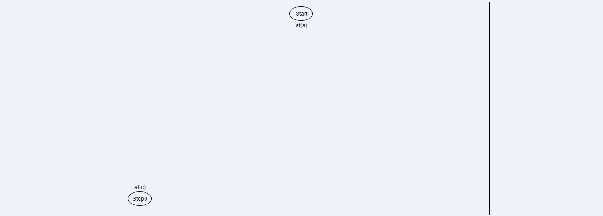
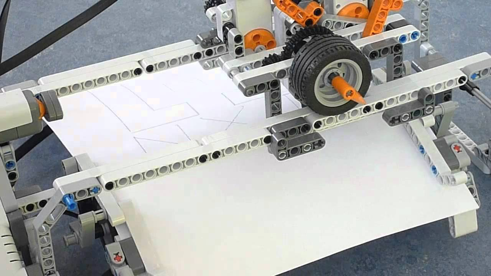

## Portfolio
---

### Experiences

#### [Work](/pages/work.md)
#### [Education](/pages/school.md)
#### [Publications](/pages/research.md)
#### [About Me](/pages/about.md)

---

### Projects

#### [iCub's Facial Controller](/projects/icub_eyelids.md)

---
#### [MyKeepon YARP & Python Controller](/projects/my_keepon_YARP.md)

---
#### [DevOps project Automation](/projects/devops.md)

<!--#### [Robust Overimpression](/projects/overimpression.md)
-->

---
#### [Cogito Ergo Expando](/projects/cogito_ergo_expando.md)

---
#### [Scout DDR](/projects/scout.md)

---
#### [Conditional Planner](/projects/conditional_planner.md)

---
#### [Geometrical Object Detection in Computer Vision](/projects/gemoetrical_cv.md)

---
#### [Lego Plotter](/projects/lego_plotter.md)

---

Page template forked from <a href="https://github.com/evanca/quick-portfolio">evanca</a>

<!-- Remove above link if you don't want to attibute -->
