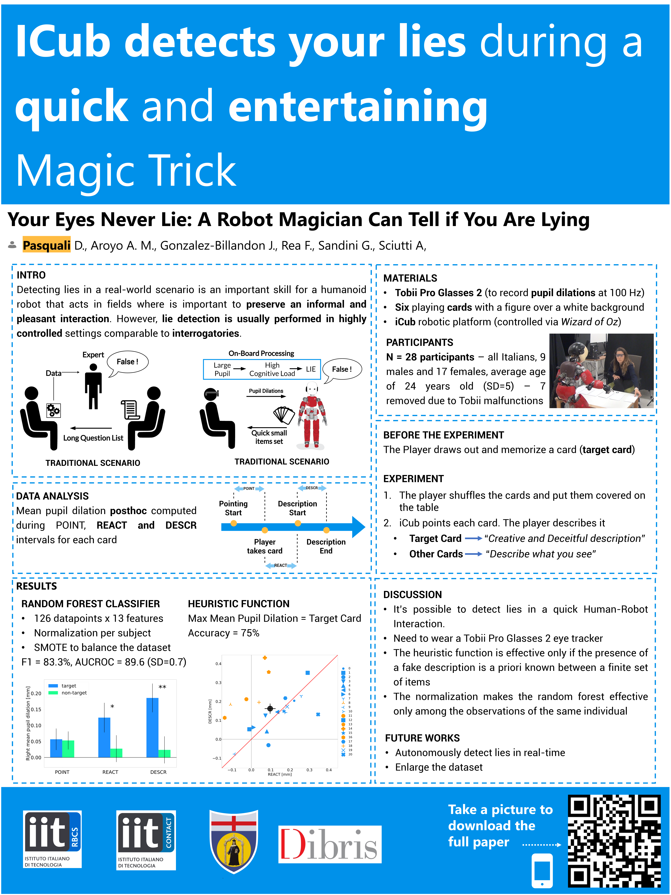
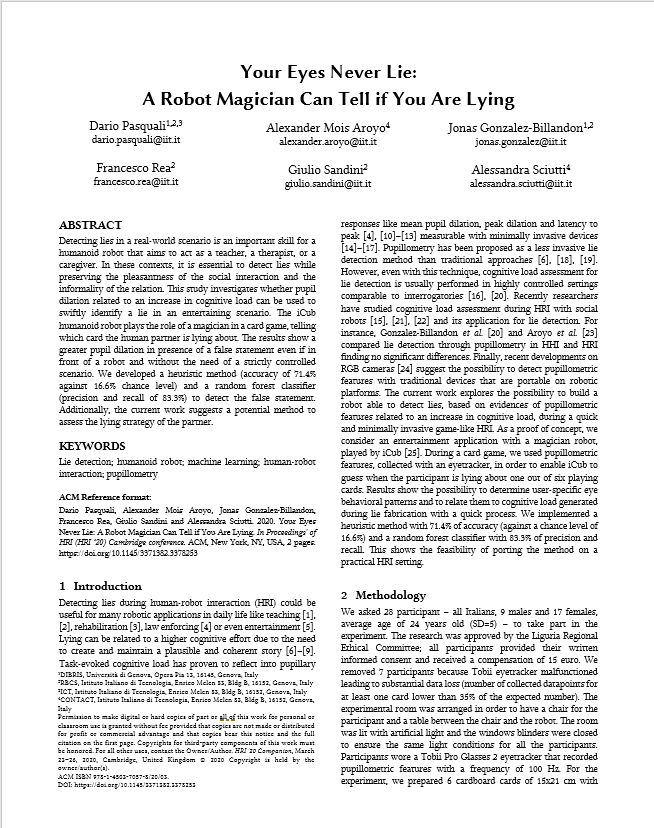

# Your Eyes Never Lie: A Robot Magician Can Tell if You Are Lying
***Pasquali D.**, Aroyo A.M., Gonzalez-Billandon J., Rea F., Sandini G., Sciutti A.* 

## [HRI 2020 Late Breaking Report - 24 March 2020](https://humanrobotinteraction.org/2020/)

### Abstract

Detecting lies in a real-world scenario is an important skill for a humanoid robot that aims to act as a teacher, a therapist, or a caregiver. In these contexts, it is essential to detect lies while preserving the pleasantness of the social interaction and the informality of the relation. This study investigates whether pupil dilation related to an increase in cognitive load can be used to swiftly identify a lie in an entertaining scenario. The iCub humanoid robot plays the role of a magician in a card game, telling which card the human partner is lying about. The results show a greater pupil dilation in presence of a false statement even if in front of a robot and without the need of a strictly controlled scenario. We developed a heuristic method (accuracy of 71.4% against 16.6% chance level) and a random forest classifier (precision and recall of 83.3%) to detect the false statement. Additionally, the current work suggests a potential method to assess the lying strategy of the partner.

 

---

### Download Poster
 

### Download Paper

