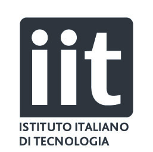

## Work Experience

---

### PhD student at Istituto Italiano di Tecnologia 

*November 2018 - Current* 
Bioengineering and Robotics 
**Topic**: Cyber Security and Social Engineering in Human-Robot Interaction. 
**Tutors**: PhD Francesco Rea and CIO Stefano Bencetti

Predict target’s compliance with a Social Engineering attack using non-verbal cues.Trust in Human-Robot and Human-Computer Interaction. Development of social robot persuasion abilities on iCub and Keepon robotic platforms

---

### Big Data Engineer at Data Reply S.r.l. 

*October 2017 - November 2018* 
Automation of development process and optimization of teamwork activities with De-vOps principles. Full-stack development of Scala and Python applications, based on Spark and Cloudera, for Big Data processing in telemetics field

--- 

### Internship at MICREL Lab of University of Bologna 

*February 2015 - December 2015* 
**Tutors**: Prof. Bruno Riccò and PhD Marco Marchesi 
Undergraduate internship developing GloVR a gesture controller for video games inte-grated with Unity an Wit.ai. Bachelor dissertation internship developing a C++ library for geometrical-based object detection in computer vision