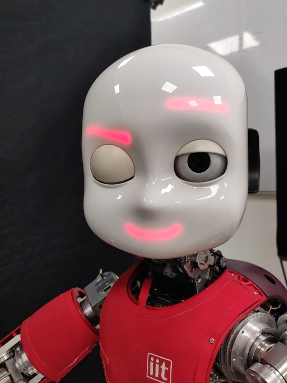

## iCub's Facial Controller

Hardware and Software update of iCub Reddy's eyelids. The new version equips a separated servo motor for each eyelid. This opens the possibility to wink and send even deeper non-verbal messages. The controller replaces the old one, controlling both yelids, facial expressions and blinkning.

Winking is one of the most complex and deep behavior of human. It usually refers to an embedded and shared secret between two partners. Something they cannot say with voice but they need to recall. Winking will be really interesting for my research in particular to enforce iCub's secret requests asked to the human partners.

---

### Architecture
The Application is composed by 4 modules:

#### Eyelids Controller
Directly inspired from [RapaPololuMaestro](https://github.com/jbitoniau/RapaPololuMaestro). Serial interface to control the Pololu Micro Maestro 6 Controller [[1]](https://www.pololu.com/product/1350). It converts positional commands to PWM signals for the two servo motors. The module implements the Pololu Compact Protocol [[2]](https://www.pololu.com/docs/0J40/5.c)[[3]](https://www.pololu.com/docs/0J40/5.e).

---

#### LED Controller
Serial Controller for the LED Facial Expressions board.

---

#### Emotion Interface
It connects to Eyelids and LED controllers to generate complex emotions.

---

#### iCub Blinker
Extension of [Robotology's iCub Blinker](https://github.com/robotology/funny-things/tree/master/modules/iCubBlinker) to controll the new Eyelids Controller. Also the interface and architecture is updated to the new standards.
