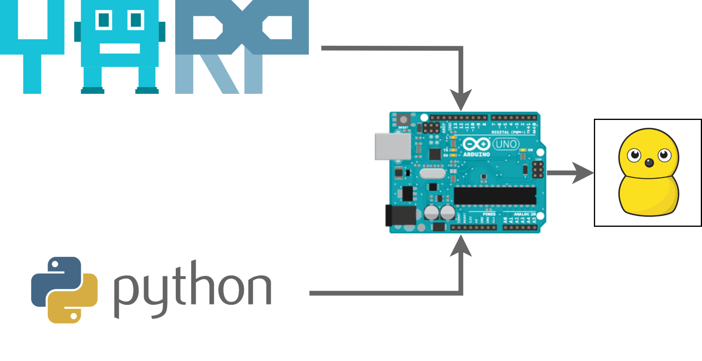

## MyKeepon YARP & Python Controller

YARP and Python application to controller the hacked version of [MyKeepon](https://beatbots.net/my-keepon) from BeatBox.

To hack MyKeepon I followed this [guide](http://probo.vub.ac.be/HackingKeepon/). My Controller is instead inspired to Beatbox [Arduino code](https://github.com/beatbots/mykeepon).

---

### Architecture

I designed a 2-level architecture: MyKeepon is controller by an Arduino Script. Commands can be sent through serial interface from a Python or YARP (C++) application.

#### Arduino Driver
MyKeepon has 4 degrees of freedom:
* Pon movements
* Pan movements
* Tilt movements
* Lateral Movements

It can also emit 64 different sounds. It has 5 buttons in the body and can record sound features like mean value and envelope.

I binded the commands to Serial messages using [CmdArduino](https://github.com/beatbots/mykeepon) library. It binds an unique command to an unique method, including also parameters..

Resppect to the original version, the library memorize the binding in a map, avoiding a long chain of if-then-else. I also exposed the possibility to toggle the sensing abilities of MyKeepon (buttons and sound). This speeds up the control and avoid useless messages.

#### Python Controller
It exploits [PySerial](https://pypi.org/project/pyserial/) module to send serial commands to Arduino. The application also exposes a REST server to remotely control MyKeepon.

#### YARP Controller
Template YARP application to create demos and experiments with MyKeepon. It send VOCAB messages to Arduino via serial interface and implement a finite state machine to easily implement behaviours. I will use this application for my future researches as Keepon is a really cute robot and no one could expect a Social Engineering attack from a toy.