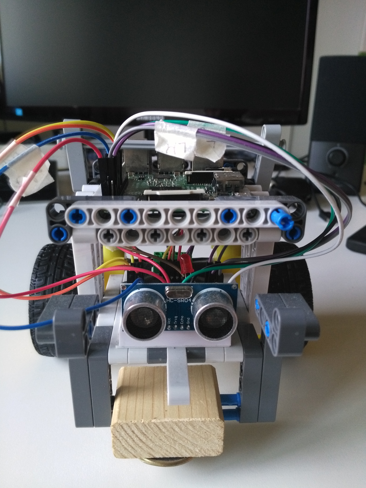
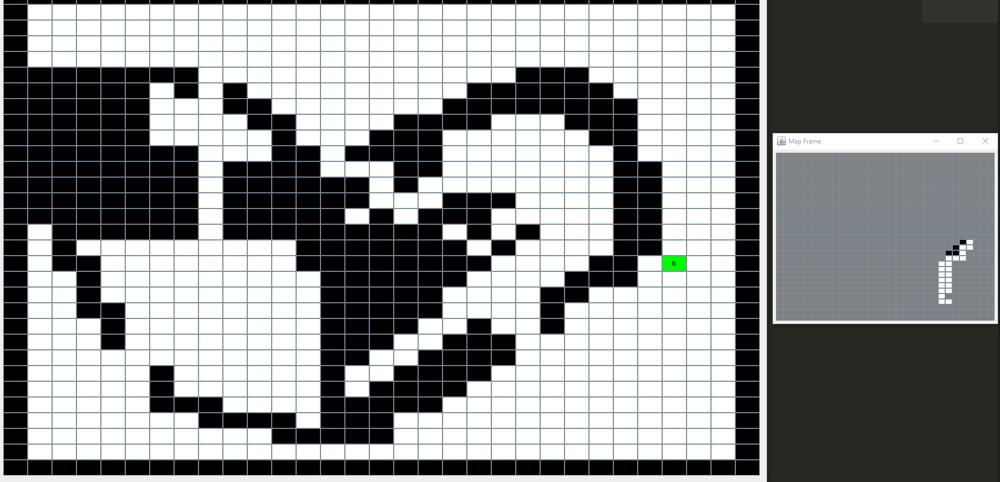
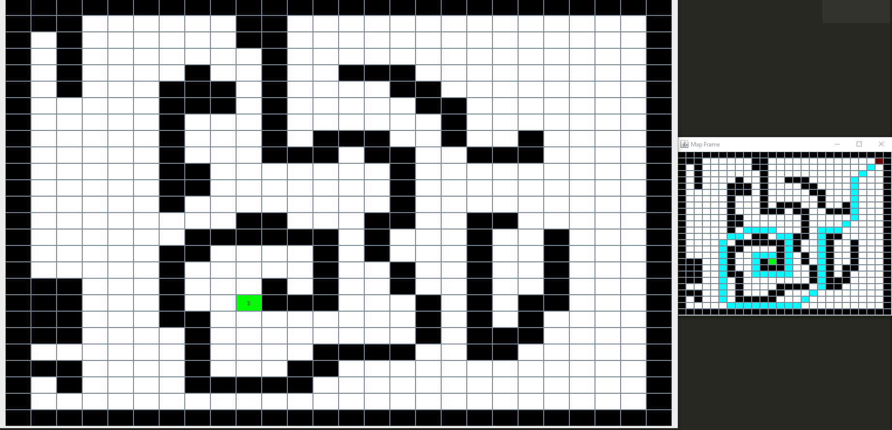

## Scout DDR: autonomous exploration and navigation

Project activity for the course of Software Engineering M at University of Bologna.
I designed and implemented **Scout** a Differential Drive Robot (DDR) able to autonomously explore and navigate an unknown environment.

The code is implemented with a custom Domain Specific Language, developed by the professor and based on Java. Thanks to the DLS, the DDR can be implemented both on a computer in a virtual custom environment and on a physical Raspberry-based robot.

### Robot Design
I built the DDR on a Lego structure. The core is a Raspberry Pi3.
The robot can move in the environment thanks to 2 servo motors and a central spherical wheel. it can also sense frontal ostacles with a sonar.

### Exploration
The Robot is able to autonomously explore a bounded environment and create a digital representation of it.

#### Map Representation
The map is represented as a matrix of discrete cells. Each cell is identified by its X, Y cordinates. Cell's state follows the Open-World Assumption (OWA): the state of each cell is unknown until an event grounds it to a defined state.

#### Robot and Movements Representation
I assume the robot dimension is the same of a cell. Also for the movements:
* The robot can move in each direction with 8-connectivity and the robot will always fit the cell.
* The robot can turn on itself of 90° units.

Moreover it can sense the state of the cell in fron of it with the sonar. Before each movement the robot checks the cell in front of it with the sonar

#### Exploration Algorithm

The exploration is based on the **Left Wall Follower algorithm**. The idea is to move in the map always keeping the left hand on a wall. If the maze is fully-connected this algorithm finds the solution in a finite time. Otherwise it will end in a loop.

I implemented a variation of the left wall follower to:
* Exit from loop situations.
* Understand if there is an unexplored area.

The DDR followes the wall, sensing the left and front cell and turning right in case of a corner. If it detects a previously walked cell it performs a search in its interal map to find the nearest unexplored and reachable cell. If it's impossible to find it the exploration is over.

The search is a Breadth-First Search algorithm that scans neighborhood cells and expands like a wildfire.

Then it reaches the unknown spot with the **Navigation Algorithm**. 

#### Navigation Algorithm

The navigation is performed with an A* Search algorithm. During the navigation, the AI assumes the Close-World Assumption: each unknonw cell is an obstacle until an event grounds it to a walkable or obstacle state. This way, the path is based only on known cells.

During the navigation the DDR keeps scanning the environment before moving to the next cell. if it discovers that a cell is not clear it stops and update the internal representation. Then the robot plans a new path to the objective.

